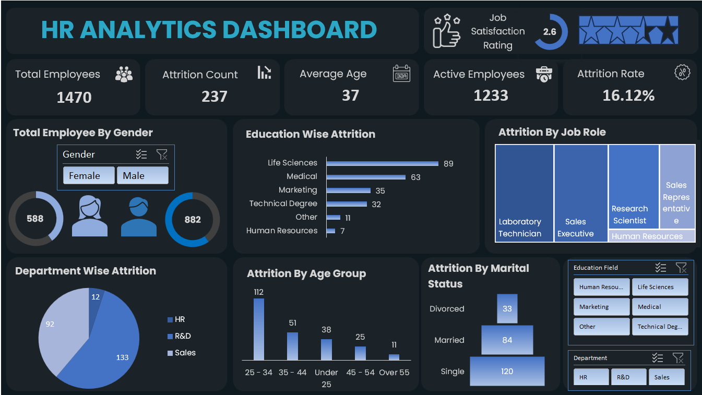

# 📊 HR Analytics Dashboard

This repository contains an **HR Analytics Dashboard** built in Excel.  
The dashboard helps HR teams analyze workforce demographics, attrition patterns, and employee satisfaction to make **data-driven decisions**.

---

## 🚀 Features
- **Key Metrics at a Glance**
  - Total Employees
  - Attrition Count
  - Average Age
  - Active Employees
  - Attrition Rate
  - Job Satisfaction Score  

- **Visual Insights**
  - 📌 **Employee Demographics**: Gender distribution  
  - 📌 **Attrition Analysis**: By Education, Job Role, Department, Age Group, Marital Status  
  - 📌 **KPIs & Trends**: Attrition rate and workforce structure  

- **Interactive Slicers**
  - Filter by **Education Field**
  - Filter by **Department**

---

## 📷 Dashboard Preview

---

## 🛠 Tools & Technologies
- **Excel / Power BI** (data visualization)  
- **Treemap, Donut, Pie, Pyramid, Bar & Column charts**  
- **Slicers for interactivity**  

---

## 📈 Insights from the Dashboard
- **Life Sciences** employees have the highest attrition.  
- **Sales Executives** show a significant attrition trend compared to other job roles.  
- **Younger employees (25–34)** have the highest attrition rate.  
- **Single employees** leave more frequently than married/divorced employees.  

