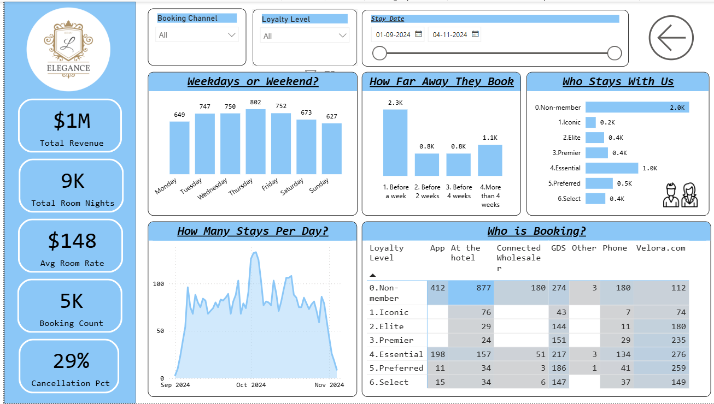

# 🏨 Hotel Booking Analysis Dashboard

This project provides a comprehensive analysis of hotel booking data using Power BI.  
It reveals booking patterns, customer behaviors, and key performance metrics to support data-driven decisions in the hospitality industry.

## 📊 Key Metrics:
- 💰 **Total Revenue:** $1M
- 🛏️ **Total Room Nights:** 9,000
- 💵 **Average Room Rate:** $148
- 📅 **Booking Count:** 5,000
- ❌ **Cancellation Rate:** 29%

---

## 🔍 Insights

### 🔸 Weekday vs Weekend Bookings
- Peak bookings occur on **Thursday** and **Friday**
- Lowest on **Sunday**

### 🔸 Advance Booking Behavior
- Most bookings are made **1 week in advance**

### 🔸 Customer Segmentation
- Majority are **Non-members**
- Highest loyalty comes from **Essential** and **Preferred** tiers

### 🔸 Booking Channels
- Top channels: **App**, **At the hotel**, and **Velora.com**

---

## 🧹 Data Cleaning Summary

Data was preprocessed using Power Query in Power BI. The following transformations were applied:

- Added columns like Revenue, How far away, How far away Bucket, Day of week, Day of weekname
- Extracted day of week, month, and booking lead time

---

## 🔄 Interactive Features

- **Reset Button:** A custom Power BI button allows users to instantly reset all filters and slicers to the original default state — improving ease of navigation during exploration.

---

## 📁 Files Included

| File Name               | Description                            |
|------------------------|----------------------------------------|
| `Dashboard.png`         | Snapshot of the final dashboard        |
| `project_description.md`| Full explanation of project insights   |
| `PowerBI_Report.pbix`   | (Optional) Report file for Power BI    |
| `reservations-1.csv` | Sample cleaned dataset     |
