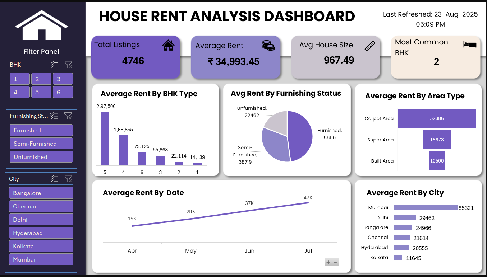

# 🏠 House Rent Analysis Dashboard  

## 📊 Project Overview  
The **House Rent Analysis Dashboard** is an interactive Excel dashboard designed to analyze rental market trends across multiple cities in India. It provides insights into rental prices, house sizes, furnishing preferences, and BHK types, helping users make data-driven decisions.  

---

## 🚀 Features  
- **KPI Cards** for quick insights:  
  - Total Listings  
  - Average Rent  
  - Average House Size  
  - Most Common BHK  

- **Interactive Filters**:  
  - City  
  - BHK Type  
  - Furnishing Status  

- **Visual Insights**:  
  - Average Rent by BHK Type  
  - Average Rent by Furnishing Status  
  - Average Rent by Area Type (Carpet, Super, Built-Up)  
  - Rent Trends over Time  
  - Average Rent by City  

- **Last Refreshed Timestamp** to show the latest update time.  

---

## 📂 Dataset  
The dataset includes the following key columns:  
- **BHK** (1, 2, 3, etc.)  
- **Furnishing Status** (Furnished, Semi-Furnished, Unfurnished)  
- **City** (Bangalore, Mumbai, Delhi, etc.)  
- **House Size** (sq. ft.)  
- **Monthly Rent (₹)**  
- **Listing Date**  

---

## 🎯 Key Insights  
- Mumbai has the **highest average rent** compared to other cities.  
- 2 BHK is the **most common house type** in the dataset.  
- Furnished houses generally have **higher average rents** compared to unfurnished ones.  
- Seasonal fluctuations in rent can be observed across months.  

---

## 🛠️ Tools & Techniques  
- **Excel** for dashboard creation  
- **Pivot Tables & Pivot Charts** for analysis  
- **Slicers** for interactivity  
- **Custom Formatting** (₹ currency, K labels, color themes)  
- **Icons & Design** for modern dashboard look  

---

## 📸 Dashboard Preview  
  

---

## 📫 Contact  
📧 shruthialvale@gmail.com  
📞 +91-6303238934  

