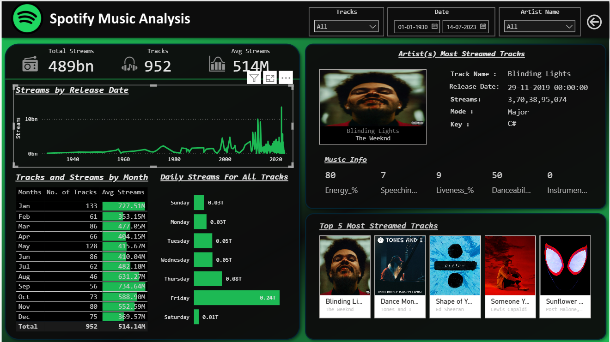

# 🎧 Spotify Music Analysis Dashboard

> 📌 **Inspired by a YouTube Power BI dashboard project**

This Power BI dashboard provides a comprehensive analysis of Spotify streaming data across different dimensions such as track popularity, artist performance, release dates, and daily/monthly listening patterns.

---

## 📊 Features

- **Total Streams, Tracks, Avg Streams Cards**
  - Total number of streams (in billions)
  - Total number of tracks
  - Average streams per track

- **Filters**
  - Track Name
  - Release Date Range
  - Artist Name

- **Visuals**
  - 📈 Streams by Release Date (line chart)
  - 📅 Tracks & Streams by Month (matrix)
  - 📆 Daily Streams for All Tracks (bar chart)
  - 🎤 Most Streamed Track by Artist (with details)
  - 🏆 Top 5 Most Streamed Tracks (horizontal gallery)

- **Music Info Metrics**
  - Energy, Speechiness, Danceability, Liveness, Instrumentalness.

- **Reset Filters**
  - A button is provided to clear all filters and reset the dashboard view.

---

## 🔧 Tools Used

- **Power BI**
- **DAX (Data Analysis Expressions)**
- Added calendar table

---

## 📌 Insights

- Identify the most popular months for music release
- Observe streaming trends across decades
- Discover top artists and their most successful tracks
- Explore listening behavior by day of the week

---

## 🧠 Learnings

- How to build interactive dashboards in Power BI
- Use of custom visuals, filters, and slicers
- Creating dynamic KPIs and data cards
- Visual storytelling with music data

---

## 📬 Contact

If you have feedback, questions, or suggestions, feel free to reach out.

---
